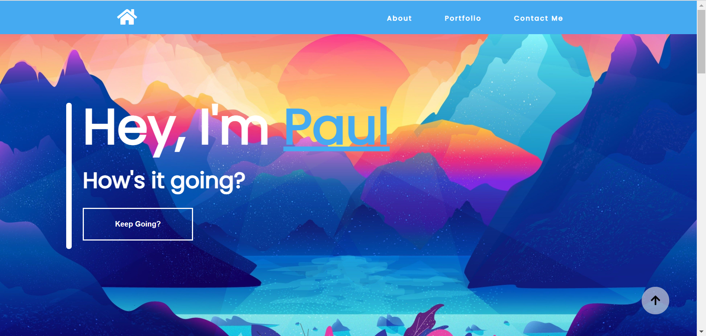
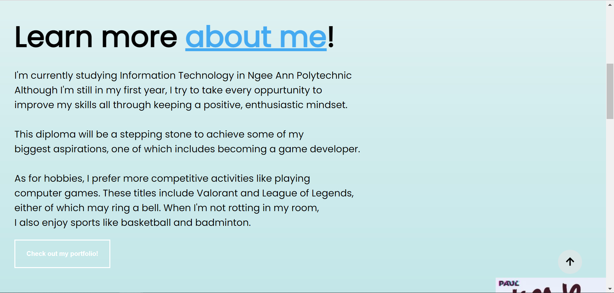
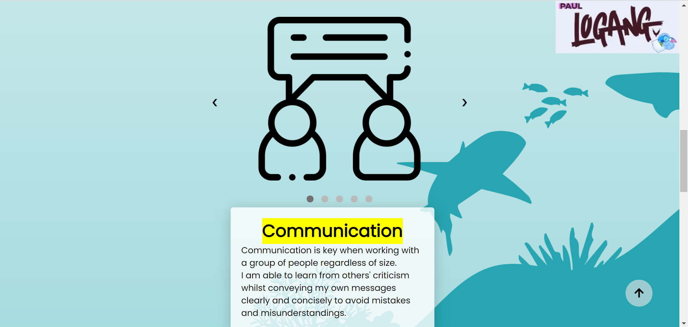
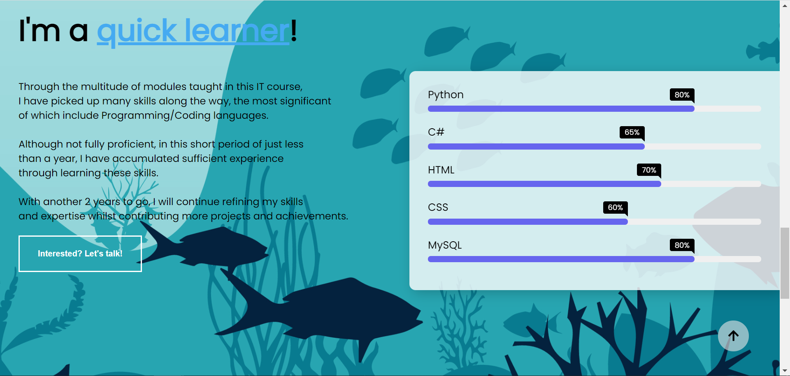
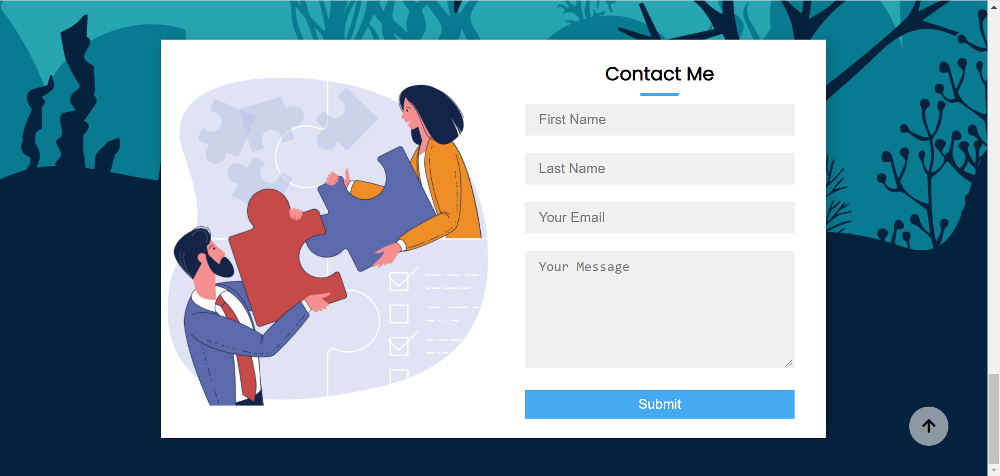

# IDAssignment1
# My Assignment 1 for Interactive Development

My page is designed to allow users to learn more about me both personally and professionally all through an aesthetically pleasing, easily navigatable site.  This includes a brief description of myself along with a showcase of the skills and valuable attributes I bring to the table. I added some additional features such as scroll button to provide convenience when navigating the website. 
 As for the design choices, I decided to go with a brighter, more cheerful feel to the page as I wanted to convey my own personality in the design of the website.

## Design Process

This website was made for potential employers to consider me as a suitable candidate for a job, taking into account my skills and attributes. It can not only present myself in a fashionable, professional setting, and clearly outlines these skills and attributes I am presenting.

### Wireframes
[ID Assignment 1 Wireframe.xd]()

### User Stories

As an employer on the website, I want the ability to contact the website creator to suggest potential interest in them which in turn increases the oppurtunities for both creator and end-user.  This is done through validation of particulars in the form. I would also want the ability to see a clear showcase of skills so as to increase ease of evaluation.

## Existing Features
Parallax effect/One-Page Website - Give a whole feeling to the website instead of constantly having to switch pages
 Navigation bar - allows end-users to navigate to a specific point in the website by clicking on their desired section.
 Scroll-To-Top Button - allows end-users to navigate back up to the beginning of the page by clicking on the button.
 Scroll-To-Next-Section button - allows end-users to again navigate to the next section by clicking the button
 Carousel - allows end-users/employers to spin through a skill showcase by clicking the right or left arrow.
 Contact Me Form - allows end-users to contact the website creator by having them fill up their name, email and message they want to send and clicking on the submit button.

### Features Left to Implement
A secondary display for achievements.
Additional Javascript for automation of animations

### Technologies Used
- Tools: Visual Studio Code, Adobe XD
- Languages: HTML, CSS, Javascript
- Libraries: Font Awesome - Used for simple, stylish icons to       replace some text for clean look. (https://fontawesome.com/)

#### General:
Responsiveness of website was hard to implement and had success with all screen widths above 425px but had major difficulty with the screen widths below that.

#### Intro Section:
Go to the start of the website
Pressing the navigation buttons in the navigation bar such as "About" scrolls to the about me page, "Portfolio" scrolls to the start of the skills/attributes showcase, "Contact" scrolls to the contact page.
The page elements re-adjust to fit smaller screen sizes. The navigation bar turns into just the logo and a burger list.

#### About Me Section:
Go to the "About" section
Pressing "Check out my portfolio" scrolls down to the "Portfolio" section

#### Portfolio section:
Go to the "Portfolio" section
Pressing the right/left arrows switches the carousel image accordingly.
The buttons at the bottom also update accordingly.
The proficiency bar chart animates to display information. Was not able to animate on entering viewport but instead only on refresh.

#### Contact Section:
Go to the "Contact" section
Try to submit the empty form and verify that an error message about the required fields appears
Try to submit the form with an invalid email address and verify that a relevant error message appears
Try to submit the form with all inputs valid and form is sent and reset when submit button is pressed.
Whole form aligns by column when on smaller screen sizes.

## Credits

### Content
Text are not taken from other sources.

### Media
google.com
https://fontawesome.com/
https://stock.adobe.com/ for images
https://www.flaticon.com/ for icons

### Acknowledgements
I received inspiration for this project from personal portfolio websites like https://jacekjeznach.com/ and https://mysweetchubswebsite-nwzwhphf4q-uc.a.run.app/
 I also received inspiration and picked up some skills from 
https://www.w3schools.com/
 Scroll to top button: https://www.youtube.com/watch?v=SJVCvnKM_lI&ab_channel=GTCoding , 
 Carousel: https://www.youtube.com/watch?v=tphDji-XZCE&t=327s&ab_channel=CodingSnow ,
 Navigation bar: https://www.youtube.com/watch?v=oLgtucwjVII&t=1s&ab_channel=CodingNepal ,
 Proficiency showcase: https://www.youtube.com/watch?v=0198ceyTVtg&t=584s&ab_channel=CodingNepal
 Contact form: https://www.youtube.com/watch?v=YBUMHRL1fmo&t=1187s&ab_channel=TylerPotts
